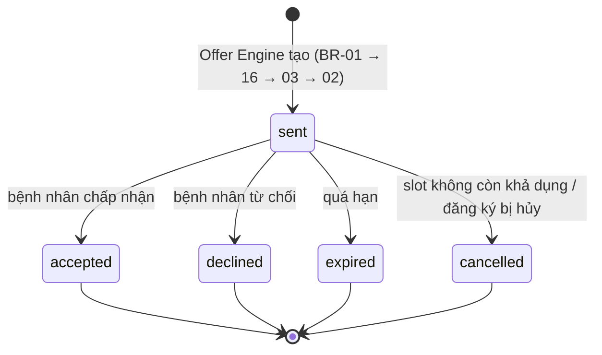
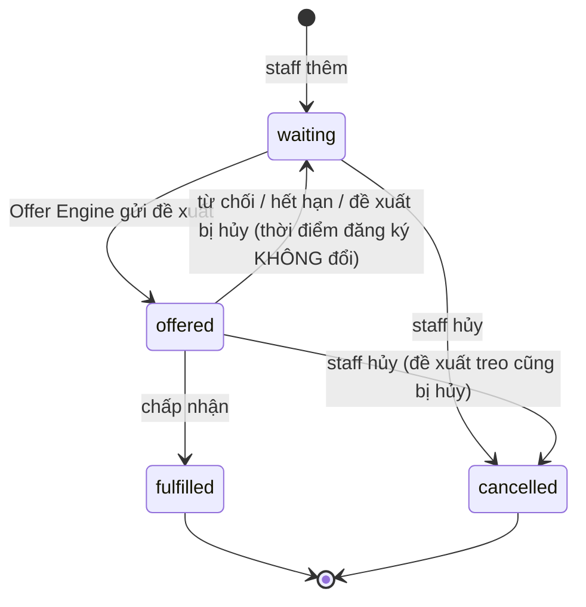

# 02 · 04 — Luồng tương tác và vòng đời trạng thái

> **Mã:** WB2-02-04 · **Phiên bản:** v0.1 · **Ngày:** 2026-09-24
> **Trạng thái:** Chờ duyệt · **Người duyệt:** [chờ Tech Lead] · **Cổng:** CP-06
> **Nguồn:** `03-thanh-phan.md`, `01-yeu-cau/03-quy-tac-nghiep-vu.md`, `01-yeu-cau/05-tieu-chi-chap-nhan.md` · **Bước WB-1:** WF-07

Luồng nghiệp vụ được thiết kế: *khi một slot trở nên khả dụng, hệ thống chọn bệnh nhân phù hợp, gửi đề xuất và xử lý phản hồi.*

---

## 1. Ngữ cảnh luồng

| Thành phần | Nội dung |
| --- | --- |
| **Mục tiêu** | Rút ngắn thời gian slot bỏ trống, bỏ gọi điện thủ công, giữ thứ tự ưu tiên minh bạch |
| **Kích hoạt** | Slot chuyển *đã đặt → còn trống* qua **một trong hai** đường: hủy lịch, hoặc staff mở lại slot (BR-01) |
| **Actor** | Bệnh nhân · Staff · Hệ thống (Offer Engine, tác vụ quét) |
| **Story** | US-02, 03, 04, 05, 06 |
| **AC** | AC-02.x → AC-06.x |
| **BR** | BR-01 → 11, 14, 15, 16 |
| **Điều kiện tiên quyết** | Có ít nhất một đăng ký chờ ở trạng thái *chờ*; slot cách hiện tại ≥ 30 phút |
| **Kết quả** | *Thành công:* lịch hẹn mới, slot đã đặt, đăng ký hoàn tất, đề xuất đã chấp nhận, ≥ 2 dòng nhật ký. *Hết ứng viên:* slot còn trống, có dòng "hết ứng viên" |

---

## 2. Luồng chính — hủy lịch dẫn tới đề xuất được chấp nhận

| Bước | Ai / thành phần | Hành động | Nội bộ / API | Trạng thái đổi |
| ---: | --- | --- | --- | --- |
| 1 | Bệnh nhân P1 | Hủy lịch hẹn A | API hủy lịch (có sẵn) | — |
| 2 | `appointmentService` | Mở giao dịch, `FOR UPDATE` trên A, kiểm quyền, đổi trạng thái | nội bộ | A → `cancelled`; slot S → `available` |
| 3 | `appointmentService` | **Commit**, nhả kết nối | nội bộ | *(đã bền vững)* |
| 4 | `appointmentService` | Gọi Offer Engine **ngoài giao dịch**, bọc try/catch | `onSlotBecameAvailable(S)` | — |
| 5 | CMP-03 | Kiểm BR-16: `giờ bắt đầu S − hiện tại ≥ 30 phút`? | nội bộ | — |
| 6 | CMP-03 | Kiểm S còn trống và không có lịch hẹn hoạt động | `slotRepository`, `appointmentRepository` | — |
| 7 | CMP-01 | Truy vấn ứng viên: `WHERE` = BR-03, `ORDER BY` = BR-02, `LIMIT 1` | `findNextCandidate(S)` | — |
| 8 | CMP-03 | Tính hạn = `min(hiện tại + 15 phút, giờ bắt đầu S)` (BR-06) | nội bộ | — |
| 9 | CMP-02 | Thêm đề xuất | `create({…})` | O = `sent` |
| 10 | CMP-01 | Đổi trạng thái đăng ký | `updateStatus(E, 'offered')` | E → `offered` |
| 11 | CMP-07 | Ghi nhật ký `offer_sent` | `append({…})` | — |
| 12 | CMP-08 | Tạo thông báo trong app, **chỉ chứa dữ liệu được phép** (BR-11), bọc try/catch riêng | `create({…})` | — |
| 13 | Bệnh nhân P2 | Mở app, thấy đề xuất | API-06 | — |
| 14 | Bệnh nhân P2 | Bấm "Chấp nhận" | API-07 | — |
| 15 | CMP-03 | **Kiểm chủ sở hữu** `O.patient_id = user.patientId` (BR-14) | nội bộ | *(sai → từ chối không đủ quyền)* |
| 16 | CMP-03 | Mở giao dịch; `findForUpdate(client, S)` | nội bộ | — |
| 17 | CMP-03 | Kiểm S còn trống | nội bộ | *(sai → xung đột; O → cancelled)* |
| 18 | CMP-03 | Tạo lịch hẹn: `appointmentRepository.create(client, …)` — **Reuse** | trong giao dịch | A2 = `booked` |
| 19 | CMP-02 | Conditional UPDATE, **đặt cả `appointment_id`** (xem §5): `… where id=$1 and status='sent' and expires_at > now()` | trong giao dịch | O → `accepted` *(không dòng ⇒ xung đột)* |
| 20 | `slotRepository` | `updateStatus(client, S, 'booked')` — **Reuse** | trong giao dịch | S → `booked` |
| 21 | CMP-01 | Đổi đăng ký | trong giao dịch | E → `fulfilled` |
| 22 | CMP-03 | **Commit** | — | — |
| 23 | CMP-07 | Ghi `offer_accepted`, `entry_fulfilled` | sau commit | — |

> **Bước 16 → 22 là một giao dịch duy nhất** — hiện thực BR-09, bản sao khuôn `bookAppointment()` (K-04).

## 3. Luồng thay thế và ngoại lệ

### A — Bệnh nhân từ chối (US-05)
A1 P gọi từ chối → A2 kiểm chủ sở hữu (BR-14) → A3 conditional UPDATE `where status='sent'` ⇒ `declined` (không dòng ⇒ xung đột) → A4 đăng ký về `waiting`, **giữ nguyên thời điểm đăng ký** → A5 ghi `offer_declined` → A6 `advanceChain(S)` quay lại bước 5 → A7 có ứng viên kế tiếp thì gửi mới, không thì ghi `no_candidate` (BR-08). Cặp (E, S) vừa từ chối bị loại nhờ BR-03 (f).

### B — Hết hạn không phản hồi (US-06)
B1 Tác vụ quét chạy mỗi chu kỳ, tìm đề xuất `sent` quá hạn → B2 với **từng** đề xuất: conditional UPDATE `where id=$1 and status='sent'` ⇒ `expired` (không dòng ⇒ đã có tiến trình khác xử lý, bỏ qua — cơ chế chống chạy chồng của AC-06.5) → B3 đăng ký về `waiting` → B4 ghi `offer_expired` → B5 **đọc lại** trạng thái slot; nếu không còn trống thì dừng (AC-06.3) → B6 `advanceChain(S)`.
Ràng buộc: B1 → B6 hoàn tất **≤ 60 giây** sau khi hết hạn (S2, AC-06.1).

### C — Không có ứng viên
`findNextCandidate` trả rỗng → ghi `no_candidate` kèm lý do (`no_match` / `lead_time` / `all_declined`) → **không** làm gì với slot (BR-08) → bệnh nhân vẫn đặt chủ động được.

### D — Slot bị chiếm trong lúc đề xuất đang treo (BR-10)
- **D-1** Bệnh nhân khác đặt chủ động: `bookAppointment()` chạy bình thường → sau commit gọi `onSlotTaken(S)` → O → `cancelled` (lý do `slot_unavailable`), E về `waiting` **giữ thời điểm đăng ký** → ghi `offer_cancelled` → P2 thấy "Khung giờ không còn khả dụng".
- **D-2** Staff chặn slot: như D-1, kích hoạt từ `updateSlot()`.
- **D-3** P2 bấm chấp nhận đúng lúc đó: `findForUpdate(S)` chờ khóa → đọc `booked` → xung đột "Khung giờ đã được đặt", rollback → **ngoài giao dịch** đánh dấu O → `cancelled`, E → `waiting`.

### E — Hai bên cùng lấy một slot (AC-04.6)
Theo BR-04 không nên xảy ra hai đề xuất; nhưng vẫn có ca *một người chấp nhận, một người đặt chủ động*. Ba lớp bảo vệ, theo thứ tự chạm tới:

| Lớp | Cơ chế | Kết quả |
| ---: | --- | --- |
| 1 | `SELECT … FOR UPDATE` trên slot ở cả hai giao dịch | Hai yêu cầu bị tuần tự hóa |
| 2 | Yêu cầu thứ hai đọc thấy slot đã đặt | Xung đột "Khung giờ đã được đặt", rollback |
| 3 | `one_active_appointment_per_slot` nếu hai lớp trên bị bỏ qua vì lỗi lập trình | DB từ chối `INSERT` |

Lớp 3 không bao giờ nên bị chạm trong vận hành bình thường; nếu log ghi vi phạm, đó là tín hiệu **lỗi ở tầng service**.

### F — Thông báo tạo thất bại nhưng đề xuất vẫn đếm giờ (RISK-02)
Đề xuất tạo xong, `expires_at` đã tính → tạo thông báo lỗi → **bọc try/catch riêng**, ghi log, không rollback đề xuất → bệnh nhân vẫn thấy đề xuất vì API-06 đọc thẳng bảng đề xuất, **không** phụ thuộc thông báo → nếu không thấy và không phản hồi thì đề xuất hết hạn bình thường.
**Nguyên tắc:** thông báo là **kênh phụ**, không phải nguồn sự thật. Thứ tự ghi có chủ ý: đề xuất → nhật ký → *rồi mới* thông báo.

### G — Chấp nhận sau khi hết hạn (tình huống bắt buộc số 3, AC-04.3)
- **G-1** Tác vụ quét đã chạy: đề xuất đã `expired`, conditional UPDATE không khớp ⇒ "Đề xuất không còn hiệu lực".
- **G-2** Tác vụ quét chưa kịp chạy: đề xuất vẫn `sent` nhưng `expires_at < now()`. Vì vậy điều kiện của conditional UPDATE phải có **cả hai** vế `status='sent' and expires_at > now()`. Không khớp thì service **đọc lại** đề xuất để phân biệt: đã quá hạn ⇒ "Đề xuất đã hết hạn"; ngược lại ⇒ "Đề xuất không còn hiệu lực".
- Bổ sung ở giao diện: khi số giây còn lại ≤ 0, vô hiệu hóa nút chấp nhận.

---

## 4. Vòng đời đề xuất



| Từ | Sang | Ai | Điều kiện | Dữ liệu cập nhật | Nếu vi phạm |
| --- | --- | --- | --- | --- | --- |
| (mới) | `sent` | Hệ thống | BR-16 ✓ · slot còn trống ✓ · có ứng viên ✓ · slot chưa có đề xuất `sent` (BR-04) ✓ · bệnh nhân chưa có đề xuất `sent` (BR-05) ✓ | thời điểm gửi, hạn, hình thức khám từ đăng ký; đăng ký → `offered` | Vi phạm BR-04/05 ⇒ DB chặn, ghi log lỗi |
| `sent` | `accepted` | Bệnh nhân | chủ sở hữu ✓ · `status='sent'` · `expires_at > now()` · slot còn trống | thời điểm phản hồi, `appointment_id`; lịch hẹn `booked`; slot `booked`; đăng ký `fulfilled` | Từ chối, xem §3 mục G |
| `sent` | `declined` | Bệnh nhân | chủ sở hữu ✓ · `status='sent'` | thời điểm phản hồi, lý do; đăng ký → `waiting` (**giữ thời điểm đăng ký**) | Từ chối không còn hiệu lực |
| `sent` | `expired` | Hệ thống | quá hạn · `status='sent'` | đăng ký → `waiting` (giữ thời điểm) | Không khớp ⇒ bỏ qua im lặng |
| `sent` | `cancelled` | Hệ thống | Slot bị chiếm, hoặc đăng ký bị hủy | lý do hủy; đăng ký → `waiting` hoặc `cancelled` | — |
| bốn trạng thái cuối | bất kỳ | **Không ai** | — | — | Từ chối không còn hiệu lực |

`accepted`, `declined`, `expired`, `cancelled` đều là **trạng thái chết**. Muốn mời lại thì tạo **đề xuất mới**, không hồi sinh cái cũ — để nhật ký là một dòng thời gian đọc được.

## 5. Kiểm soát chuyển trạng thái không hợp lệ

Mọi phép chuyển dùng **conditional UPDATE**, không đọc-rồi-ghi.

```sql
-- mẫu chung: declined, expired, cancelled
update appointment_offers
set status = $2, responded_at = now(), updated_at = now()
where id = $1 and status = 'sent'
returning id
```

```sql
-- mẫu riêng cho accepted — KHÁC mẫu chung
update appointment_offers
set status = 'accepted', appointment_id = $2, responded_at = now(), updated_at = now()
where id = $1 and status = 'sent' and expires_at > now()
returning id
```

> ⚠️ **Hai khác biệt bắt buộc cho `accepted`**
> 1. **Đặt `appointment_id` trong cùng câu lệnh.** Ràng buộc `check ((status = 'accepted') = (appointment_id is not null))` sẽ từ chối câu lệnh nếu thiếu. Vì vậy `appointmentRepository.create()` phải chạy **trước** câu UPDATE này trong cùng giao dịch, để có sẵn `appointment_id`.
> 2. **Phải có `and expires_at > now()`.** Thiếu vế này thì chấp nhận được đề xuất đã quá hạn khi tác vụ quét chậm vài giây.

Không có dòng trả về ⇒ trạng thái đã đổi hoặc đã quá hạn ⇒ xung đột. Không có khe hở thời gian giữa đọc và ghi (khuôn `confirmBooked()` sẵn có).

## 6. Vòng đời đăng ký chờ



> **Bất biến quan trọng nhất:** `offered → waiting` **không bao giờ** đổi thời điểm đăng ký. Nếu đổi, người từ chối một đề xuất bị đẩy xuống cuối hàng đợi — biến việc từ chối thành hình phạt ngầm, sai BR-10 và sai tinh thần công bằng của mục tiêu.

## 7. Tám tình huống WB-2 yêu cầu

| # | Tình huống | Xử lý | Kết quả | AC |
| ---: | --- | --- | --- | --- |
| 1 | Accepted | Giao dịch của BR-09 | offer `accepted`, lịch hẹn `booked`, slot `booked`, đăng ký `fulfilled` | AC-04.1 |
| 2 | Rejected | UPDATE → `declined`; đăng ký về `waiting`; `advanceChain()` | offer `declined`, đăng ký `waiting` | AC-05.1 |
| 3 | Expired | Tác vụ quét → `expired`; đăng ký về `waiting`; `advanceChain()` nếu slot còn trống | offer `expired`, đăng ký `waiting` | AC-06.1 |
| 4 | Cancelled | Staff hủy đăng ký hoặc slot bị chiếm | offer `cancelled` | AC-08.2 |
| 5 | Timeout | Như #3; xử lý ≤ 60 giây sau khi hết hạn | — | AC-06.1 |
| 6 | Đề xuất bị thay thế | **Không xảy ra theo thiết kế:** BR-04 bảo đảm mỗi slot một đề xuất `sent`; đề xuất cũ phải kết thúc trước khi tạo mới | — | AC-03.1 |
| 7 | Slot đã được bệnh nhân khác xác nhận | `onSlotTaken` → `cancelled`, đăng ký về `waiting`; nếu bấm chấp nhận đúng lúc đó → khóa dòng phát hiện ⇒ xung đột | offer `cancelled` | AC-04.2, 06.3 |
| 8 | Sự kiện xử lý lặp lại | Mọi handler idempotent nhờ conditional UPDATE | Không đổi sau lần đầu | AC-04.4, 06.5 |

## 8. Ma trận idempotency

| Thao tác | Gọi lần 2 cùng đầu vào | Kết quả | Cơ chế |
| --- | --- | --- | --- |
| `onSlotBecameAvailable(slotId)` | Đã có đề xuất `sent` | Không tạo đề xuất thứ hai | BR-04 + ràng buộc duy nhất |
| `onSlotTaken(slotId)` | Đề xuất đã `cancelled` | Không đổi | UPDATE không khớp |
| `acceptOffer(offerId)` | Đã `accepted` | Xung đột, **không** tạo lịch hẹn thứ hai | UPDATE `where status='sent'` |
| `declineOffer(offerId)` | Đã `declined` | Xung đột | UPDATE |
| `expireOffer(offerId)` | Đã `expired` | Bỏ qua im lặng, không ghi log trùng | UPDATE |
| Tác vụ quét chạy chồng | Hai lượt cùng thấy một đề xuất | Chỉ một lượt thành công | UPDATE |
| Thêm đăng ký chờ | Cùng bệnh nhân + tiêu chí | Xung đột | Ràng buộc duy nhất ở ENT-01 |

## 9. Bất biến dữ liệu

| # | Bất biến |
| ---: | --- |
| I-1 | Mỗi slot có tối đa **một** đề xuất `sent` |
| I-2 | Mỗi bệnh nhân có tối đa **một** đề xuất `sent` |
| I-3 | `offer.status='accepted'` ⟺ `offer.appointment_id` có giá trị |
| I-4 | Đề xuất `accepted` ⇒ slot của nó `booked` và có đúng một lịch hẹn hoạt động |
| I-5 | Đăng ký `offered` ⇒ tồn tại đúng một đề xuất `sent` trỏ về nó |
| I-6 | Đăng ký `waiting` ⇒ **không** có đề xuất `sent` nào trỏ về nó |
| I-7 | Mọi đề xuất có `expires_at > sent_at` |
| I-8 | Mọi chuyển trạng thái đề xuất có ít nhất một dòng nhật ký |
| I-9 | Thời điểm đăng ký của đăng ký chờ không bao giờ đổi sau khi tạo |

**Truy vấn kiểm tra lệch** — dùng khi gỡ lỗi và khi QA kiểm chứng; **cả bốn phải trả 0 dòng**:

```sql
-- I-5, I-6
select e.id, e.status, count(o.id) as pending_offers
from waiting_list_entries e
left join appointment_offers o on o.waiting_list_entry_id = e.id and o.status = 'sent'
group by e.id, e.status
having (e.status = 'offered' and count(o.id) <> 1) or (e.status = 'waiting' and count(o.id) > 0);

-- I-4
select o.id, o.slot_id, s.status
from appointment_offers o join slots s on s.id = o.slot_id
where o.status = 'accepted' and s.status <> 'booked';

-- I-3
select id, status, appointment_id from appointment_offers
where (status = 'accepted') <> (appointment_id is not null);

-- chỉ báo sức khỏe của tác vụ quét: quá hạn hơn 5 phút mà chưa dọn
select id, expires_at, now() - expires_at as overdue
from appointment_offers
where status = 'sent' and expires_at < now() - interval '5 minutes';
```

Câu cuối là **chỉ báo sức khỏe của tác vụ quét**: nếu trả về dòng trong vận hành bình thường thì tác vụ đã dừng hoặc lỗi (RISK-09).
