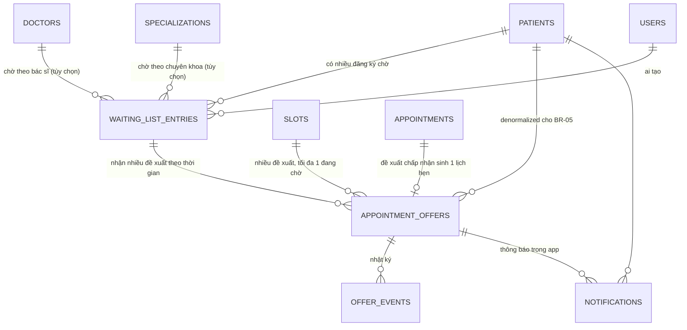

# 02 · 06 — Dữ liệu

> **Mã:** WB2-02-06 · **Phiên bản:** v0.1 · **Ngày:** 2026-09-24
> **Trạng thái:** Chờ duyệt · **Người duyệt:** [chờ Tech Lead] · **Cổng:** CP-06
> **Nguồn:** `01-yeu-cau/03-quy-tac-nghiep-vu.md`, `03-thanh-phan.md`, `04-luong-va-trang-thai.md`, `00-boi-canh/01-he-thong-hien-tai.md` §2 · **Bước WB-1:** WF-07

**Nguyên tắc:** không tạo thực thể mới nếu mở rộng hoặc tái sử dụng được. **Không sửa 6 bảng hiện có** (C4, K-05).

---

## 1. Ngữ cảnh dữ liệu

| Thành phần | Nội dung |
| --- | --- |
| BR ảnh hưởng dữ liệu | BR-02 (mức ưu tiên, thời điểm đăng ký) · BR-03 (bác sĩ / chuyên khoa, khoảng ngày) · BR-04, 05 (ràng buộc duy nhất từng phần) · BR-06 (hạn tuyệt đối) · BR-09 (liên kết đề xuất ↔ lịch hẹn) · BR-15 (nhật ký) |
| AC liên quan | AC-02.5 → 02.7 (thứ tự xác định) · AC-04.4 (idempotency) · AC-06.5 (quét chồng nhau) · AC-09.1 (nhật ký đủ) |
| Thực thể tái sử dụng | `patients`, `doctors`, `specializations`, `slots`, `appointments`, `users` (làm khóa ngoại) |
| Ràng buộc hiện có | `one_active_appointment_per_slot`; `CHECK` cho mọi cột enum; migration idempotent (K-05) |
| Riêng tư / lưu giữ | BR-11 cấm dữ liệu y tế trong nội dung đề xuất; lưu giữ: Q-15 `[ĐỀ XUẤT]` giữ vô thời hạn |
| **`[CẦN XÁC NHẬN]`** | Chính sách xóa nhật ký thật (Q-15) · lọc theo giờ trong ngày (R-05) |

## 2. Tái sử dụng, mở rộng hay tạo mới

| Thực thể | Loại | Lý do |
| --- | :---: | --- |
| `patients` | **Reuse — không sửa** | Mức ưu tiên gắn với **lần chờ này**, không phải thuộc tính vĩnh viễn của người; thêm cột vào đây sai ngữ nghĩa và vi phạm C4 (R-04) |
| `slots` | **Reuse — không sửa** | Đề xuất tham chiếu slot qua khóa ngoại |
| `appointments` | **Reuse — không sửa** | Lịch hẹn tạo từ đề xuất là lịch hẹn bình thường. Truy vết "lịch này đến từ đề xuất nào" nằm ở `appointment_offers.appointment_id`, không ở chiều ngược lại — tránh thêm cột vào bảng nghiệp vụ quan trọng nhất |
| `waiting_list_entries` | **New — ENT-01** | Không bảng nào mang được ngữ nghĩa "đăng ký chờ" |
| `appointment_offers` | **New — ENT-02** | Xem §3 |
| `offer_events` | **New — ENT-03** | BR-15; hệ thống hiện không có bảng nhật ký nào |
| `notifications` | **New — ENT-04** | Tách kênh thông báo khỏi Offer Engine (R-01) |

## 3. Đề xuất là thực thể độc lập — vì sao

| Khả năng | Đánh giá | Lý do |
| --- | :---: | --- |
| Một **trạng thái** của `appointments` (thêm `offered`) | ❌ Loại | Phần lớn đề xuất **không bao giờ** thành lịch hẹn (bị từ chối, hết hạn) — sẽ sinh hàng loạt dòng "lịch hẹn" chưa từng là lịch hẹn. Nghiêm trọng hơn: `one_active_appointment_per_slot` phải bao gồm cả `offered`, khiến **không thể cùng lúc xét hai người** cho một slot ở bất kỳ thiết kế nào sau này |
| Một **phần mở rộng** của `appointments` (bảng 1-1) | ❌ Loại | Vẫn cần một dòng `appointments` cho mỗi đề xuất ⇒ mọi vấn đề trên còn nguyên |
| **Thực thể độc lập** | ✅ Chọn | Có vòng đời riêng (5 trạng thái), có ràng buộc duy nhất riêng (BR-04, 05), tồn tại độc lập với lịch hẹn. Khi được chấp nhận, nó **sinh ra** một lịch hẹn và ghi lại `appointment_id` |

**Hệ quả:** `appointments` không thêm cột nào — rủi ro regression về gần bằng không.

---

## 4. ENT-01 · `waiting_list_entries`

| Cột | Kiểu | Null | Mặc định | Ý nghĩa |
| --- | --- | :---: | --- | --- |
| `id` | serial | ✗ | tự tăng | PK |
| `patient_id` | integer | ✗ | | FK → `patients` |
| `doctor_id` | integer | ✓ | NULL | FK → `doctors`. NULL ⇒ chờ theo chuyên khoa |
| `specialization_id` | integer | ✓ | NULL | FK → `specializations`. Dùng khi `doctor_id` NULL (BR-03 b) |
| `medical_priority` | varchar(10) | ✗ | `'normal'` | `urgent` \| `high` \| `normal` (BR-02) |
| `preferred_type` | varchar(20) | ✗ | `'in_person'` | `in_person` \| `online`; dùng làm hình thức khám khi tạo lịch hẹn (R-16) |
| `status` | varchar(20) | ✗ | `'waiting'` | `waiting` \| `offered` \| `fulfilled` \| `cancelled` |
| `desired_from`, `desired_to` | date | ✓ | NULL | Khoảng ngày mong muốn (BR-03 e) |
| `note` | varchar(255) | ✓ | NULL | Ghi chú điều phối; **cấm** thông tin y tế (BR-11) |
| `created_by_user_id` | integer | ✓ | NULL | FK → `users`. Chừa sẵn cho Q-13 và truy vết ai gán `urgent` (R-13) |
| `created_at` | timestamptz | ✗ | `now()` | **Tiêu chí thứ hai của BR-02.** Không đổi khi đăng ký quay lại `waiting` |
| `updated_at` | timestamptz | ✗ | `now()` | Đổi mỗi lần đổi trạng thái |

Ràng buộc: `CHECK` cho ba enum · `CHECK (doctor_id is not null or specialization_id is not null)` (AC-01.3) · `CHECK (desired_to is null or desired_from is null or desired_to >= desired_from)`.

Chỉ mục: duy nhất từng phần theo `(patient_id, coalesce(doctor_id,0), coalesce(specialization_id,0)) where status in ('waiting','offered')` (AC-01.5) · `(status, medical_priority, created_at)` cho truy vấn chọn ứng viên · `(patient_id)`.

> **`created_at` không bao giờ được cập nhật khi đăng ký quay lại `waiting`** — nếu không, người từ chối một đề xuất bị đẩy xuống cuối hàng đợi, sai BR-10.

## 5. ENT-02 · `appointment_offers`

| Cột | Kiểu | Null | Mặc định | Ý nghĩa |
| --- | --- | :---: | --- | --- |
| `id` | serial | ✗ | | PK |
| `waiting_list_entry_id` | integer | ✗ | | FK → `waiting_list_entries` |
| `patient_id` | integer | ✗ | | FK → `patients`. Denormalized từ đăng ký, cần cho ràng buộc của BR-05 |
| `slot_id` | integer | ✗ | | FK → `slots` |
| `appointment_type` | varchar(20) | ✗ | `'in_person'` | Chốt lúc gửi, sao chép từ `preferred_type` |
| `status` | varchar(20) | ✗ | `'sent'` | `sent` \| `accepted` \| `declined` \| `expired` \| `cancelled` |
| `sent_at` | timestamptz | ✗ | `now()` | |
| `expires_at` | timestamptz | ✗ | | **`timestamptz`, không phải `date`+`time`** (BR-06) |
| `responded_at` | timestamptz | ✓ | NULL | Thời điểm chấp nhận / từ chối |
| `appointment_id` | integer | ✓ | NULL | FK → `appointments`. Chỉ có giá trị khi `accepted`; **chiều truy vết duy nhất** offer ↔ lịch hẹn |
| `cancel_reason` | varchar(50) | ✓ | NULL | `slot_unavailable` \| `entry_cancelled` \| `staff_blocked` |
| `decline_reason` | varchar(255) | ✓ | NULL | Bệnh nhân nhập, tùy chọn; **cấm** thông tin y tế |
| `created_at`, `updated_at` | timestamptz | ✗ | `now()` | |

Ràng buộc: `CHECK` trạng thái và hình thức khám · `CHECK (expires_at > sent_at)` · `CHECK ((status = 'accepted') = (appointment_id is not null))`.

**Hai chỉ mục duy nhất từng phần là bắt buộc**, không tùy chọn:
```sql
create unique index if not exists one_pending_offer_per_slot    on appointment_offers(slot_id)    where status = 'sent';  -- BR-04
create unique index if not exists one_pending_offer_per_patient on appointment_offers(patient_id) where status = 'sent';  -- BR-05
```
Cộng thêm: `(expires_at) where status='sent'` cho tác vụ quét; `(waiting_list_entry_id, slot_id, status)` cho BR-03 (f).

> Hai chỉ mục này sao chép **đúng** mô hình `one_active_appointment_per_slot`: luật sống còn ở **cả code lẫn cơ sở dữ liệu**. Nếu một AI tương lai thêm đường ghi mới mà quên kiểm tra, DB vẫn chặn.

## 6. ENT-03 · `offer_events` (chỉ thêm)

| Cột | Kiểu | Ý nghĩa |
| --- | --- | --- |
| `id` | bigserial | PK |
| `occurred_at` | timestamptz | `now()` |
| `event_type` | varchar(30) | `offer_sent`, `offer_accepted`, `offer_declined`, `offer_expired`, `offer_cancelled`, `no_candidate`, `entry_created`, `entry_cancelled`, `entry_fulfilled` |
| `offer_id`, `waiting_list_entry_id`, `slot_id`, `patient_id` | integer, null được | FK. `offer_id` NULL với `no_candidate` |
| `from_status`, `to_status` | varchar(20) | Trạng thái trước / sau |
| `actor` | varchar(10) | `patient` \| `staff` \| `system` (mặc định `system`) |
| `actor_user_id` | integer | FK → `users`; NULL khi hệ thống |
| `reason` | varchar(100) | `no_match`, `lead_time`, `all_declined`, `slot_unavailable`… |

Chỉ mục: `(slot_id, occurred_at)`, `(patient_id, occurred_at)`.

**Ba quy tắc bất biến:** (1) chỉ `INSERT` — CMP-07 không có hàm sửa hay xóa; (2) **không** lưu mức ưu tiên y tế (R-12); (3) ghi **sau khi giao dịch chính đã commit** — mất một dòng log không được làm hỏng nghiệp vụ.

## 7. ENT-04 · `notifications`

`id`, `patient_id` (FK), `offer_id` (FK, null được), `type` (`offer_sent` \| `offer_expired` \| `offer_cancelled` \| `appointment_created`), `title` (≤ 120), `body` (≤ 400 — **chỉ** bác sĩ, chuyên khoa, phòng, ngày, giờ, hạn: BR-11), `read_at`, `created_at`. Chỉ mục `(patient_id, created_at desc)`.

> Bảng này là **kênh phụ trợ, không phải nguồn sự thật**: API-06 đọc thẳng `appointment_offers`. Tạo thông báo thất bại thì đề xuất vẫn hợp lệ (luồng F, RISK-02).

## 8. Sơ đồ quan hệ



Bốn bảng mới **không** thay đổi một quan hệ nào giữa 6 bảng cũ.

---

## 9. Migration

Thêm vào cuối template SQL trong `src/db/migrate.js`. Toàn bộ **idempotent** (K-05). **Rollback:** `drop table if exists notifications, offer_events, appointment_offers, waiting_list_entries cascade;` — không đụng dữ liệu cũ.

```sql
create table if not exists waiting_list_entries (
  id serial primary key,
  patient_id integer not null references patients(id),
  doctor_id integer references doctors(id),
  specialization_id integer references specializations(id),
  medical_priority varchar(10) not null default 'normal' check (medical_priority in ('urgent','high','normal')),
  preferred_type varchar(20) not null default 'in_person' check (preferred_type in ('in_person','online')),
  status varchar(20) not null default 'waiting' check (status in ('waiting','offered','fulfilled','cancelled')),
  desired_from date,
  desired_to date,
  note varchar(255),
  created_by_user_id integer references users(id),
  created_at timestamptz not null default now(),
  updated_at timestamptz not null default now(),
  check (doctor_id is not null or specialization_id is not null),
  check (desired_to is null or desired_from is null or desired_to >= desired_from)
);

create table if not exists appointment_offers (
  id serial primary key,
  waiting_list_entry_id integer not null references waiting_list_entries(id),
  patient_id integer not null references patients(id),
  slot_id integer not null references slots(id),
  appointment_type varchar(20) not null default 'in_person' check (appointment_type in ('in_person','online')),
  status varchar(20) not null default 'sent' check (status in ('sent','accepted','declined','expired','cancelled')),
  sent_at timestamptz not null default now(),
  expires_at timestamptz not null,
  responded_at timestamptz,
  appointment_id integer references appointments(id),
  cancel_reason varchar(50),
  decline_reason varchar(255),
  created_at timestamptz not null default now(),
  updated_at timestamptz not null default now(),
  check (expires_at > sent_at),
  check ((status = 'accepted') = (appointment_id is not null))
);

create table if not exists offer_events (
  id bigserial primary key,
  occurred_at timestamptz not null default now(),
  event_type varchar(30) not null check (event_type in (
    'offer_sent','offer_accepted','offer_declined','offer_expired','offer_cancelled',
    'no_candidate','entry_created','entry_cancelled','entry_fulfilled')),
  offer_id integer references appointment_offers(id),
  waiting_list_entry_id integer references waiting_list_entries(id),
  slot_id integer references slots(id),
  patient_id integer references patients(id),
  from_status varchar(20),
  to_status varchar(20),
  actor varchar(10) not null default 'system' check (actor in ('patient','staff','system')),
  actor_user_id integer references users(id),
  reason varchar(100)
);

create table if not exists notifications (
  id serial primary key,
  patient_id integer not null references patients(id),
  offer_id integer references appointment_offers(id),
  type varchar(30) not null,
  title varchar(120) not null,
  body varchar(400) not null,
  read_at timestamptz,
  created_at timestamptz not null default now()
);

create unique index if not exists uniq_active_entry_per_patient_target
  on waiting_list_entries(patient_id, coalesce(doctor_id, 0), coalesce(specialization_id, 0))
  where status in ('waiting','offered');
create index if not exists idx_wle_selection on waiting_list_entries(status, medical_priority, created_at);
create index if not exists idx_wle_patient on waiting_list_entries(patient_id);

create unique index if not exists one_pending_offer_per_slot    on appointment_offers(slot_id)    where status = 'sent';
create unique index if not exists one_pending_offer_per_patient on appointment_offers(patient_id) where status = 'sent';
create index if not exists idx_offers_expiry on appointment_offers(expires_at) where status = 'sent';
create index if not exists idx_offers_entry_slot on appointment_offers(waiting_list_entry_id, slot_id, status);

create index if not exists idx_events_slot    on offer_events(slot_id, occurred_at);
create index if not exists idx_events_patient on offer_events(patient_id, occurred_at);
create index if not exists idx_notifications_patient on notifications(patient_id, created_at desc);
```

## 10. Truy vấn chọn ứng viên — hiện thực BR-02 + BR-03

Bản dịch **trực tiếp** của hai quy tắc; mỗi mệnh đề `WHERE` tương ứng một BR.

```sql
select e.*
from waiting_list_entries e
join slots s on s.id = $1
join doctors d on d.id = s.doctor_id
where e.status = 'waiting'                                            -- BR-03 a
  and (e.doctor_id = s.doctor_id                                      -- BR-03 b
       or (e.doctor_id is null and e.specialization_id = d.specialization_id))
  and not exists (select 1 from appointment_offers o                  -- BR-03 c (BR-05)
                  where o.patient_id = e.patient_id and o.status = 'sent')
  and not exists (select 1 from appointments a                        -- BR-03 d
                  join slots s2 on s2.id = a.slot_id
                  where a.patient_id = e.patient_id and a.status in ('booked','confirmed')
                    and s2.date = s.date and s2.start_time < s.end_time and s2.end_time > s.start_time)
  and (e.desired_from is null or s.date >= e.desired_from)            -- BR-03 e
  and (e.desired_to   is null or s.date <= e.desired_to)
  and not exists (select 1 from appointment_offers o2                 -- BR-03 f
                  where o2.waiting_list_entry_id = e.id and o2.slot_id = s.id
                    and o2.status in ('declined','expired'))
order by
  case e.medical_priority when 'urgent' then 3 when 'high' then 2 else 1 end desc,   -- BR-02.1
  e.created_at asc,                                                                  -- BR-02.2
  e.id asc                                                                           -- BR-02.3
limit 1;
```

**Hai điều cấm khi hiện thực:** không `order by random()` hay bất kỳ yếu tố ngẫu nhiên nào (AC-02.7 chạy 10 lần ra cùng kết quả) · không nới lỏng bất kỳ `not exists` nào để "tăng tỷ lệ lấp slot" — mỗi mệnh đề là một BR chờ Human duyệt.

> **Đã kiểm chứng trên PostgreSQL 16 (2026-09-24, cơ sở dữ liệu tạm, không đụng dữ liệu ứng dụng):** migration chạy 3 lần liên tiếp không lỗi · truy vấn trên chọn đúng `urgent` dù vào sau cùng (AC-02.5), loại đúng ứng viên trùng giờ (BR-03 d), ngoài khoảng ngày (e), đã từ chối slot này (f) · phá hòa theo mã tăng dần ra cùng kết quả · hai chỉ mục duy nhất của BR-04, BR-05 từ chối đề xuất thứ hai · `CHECK` từ chối `accepted` thiếu `appointment_id` và từ chối đăng ký không có cả bác sĩ lẫn chuyên khoa · chỉ mục chống trùng đăng ký chờ hoạt động (AC-01.5) · chỉ lùi `expires_at` mà không lùi `sent_at` bị từ chối đúng như cảnh báo ở `03-trien-khai/02` §4a. **Chưa kiểm chứng:** hành vi ở tầng service và đồng thời — thuộc WB-3.

## 11. Dữ liệu mẫu bổ sung

Idempotent, ngày tương đối, **không ghi đè dữ liệu người dùng vừa tạo**. Dùng `on conflict do nothing` cho đăng ký mẫu — **không** bắt chước `on conflict do update` của seed hiện có, vì nó hồi sinh dữ liệu đã hủy và có thể làm ứng dụng không khởi động lại được (`Workbooks/boi-canh-chung/`: HT-GAP-01, 02).

| Đăng ký | Bệnh nhân | Tiêu chí | Mức ưu tiên | Mục đích demo |
| --- | --- | --- | :---: | --- |
| 1 | Linh (id 2) | Bác sĩ id 1 | `normal` | Ứng viên cơ bản |
| 2 | Huy (id 3) | Bác sĩ id 1 | `urgent` | **Chứng minh BR-02**: vào sau Linh nhưng được chọn trước |
| 3 | Nhi (id 4) | Chuyên khoa id 1 (Tim mạch) | `high` | Chứng minh BR-03 (b) — khớp theo chuyên khoa |

Không seed sẵn đề xuất: đề xuất phải do hệ thống sinh ra để demo chứng minh Offer Engine thật sự chạy.

> ⚠️ **Lưu ý khi demo:** slot mẫu có giờ cố định trong ngày, ngày tương đối. Nếu chạy demo **sau** giờ của slot, BR-16 sẽ chặn (không gửi đề xuất). Nên dùng slot của ngày mai, hoặc để staff tạo slot mới rồi đặt và hủy.

## 12. Danh sách kiểm tra dữ liệu

- [x] Không trùng dữ liệu đã có — không cột nào lặp lại thông tin của 6 bảng cũ
- [x] Có trạng thái rõ ràng — hai vòng đời ở `04-luong-va-trang-thai.md`
- [x] Có cơ chế tránh cập nhật xung đột — conditional UPDATE + khóa dòng + hai chỉ mục duy nhất
- [x] Có timestamp và audit — `created_at`/`updated_at` mọi bảng + nhật ký chỉ thêm
- [ ] Chính sách lưu giữ — `[CẦN XÁC NHẬN]` Q-15
- [x] Không lưu dữ liệu nhạy cảm không cần thiết — không lý do khám, chẩn đoán; mức ưu tiên không vào nhật ký
